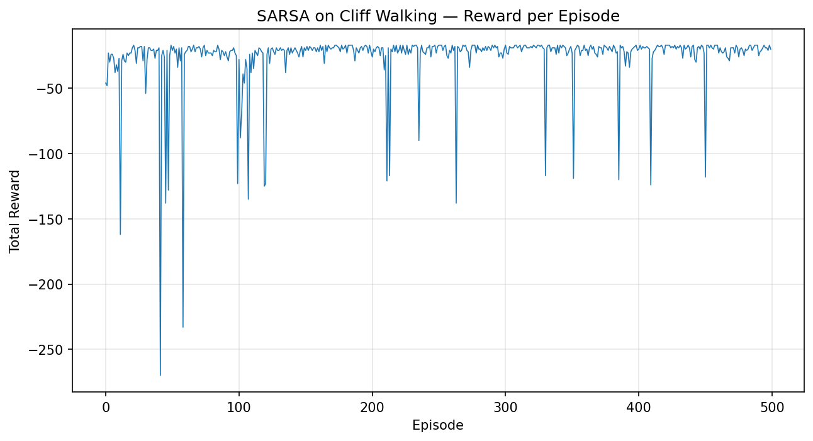

# 🧗 Cliff Walking — SARSA

<div align="center">

**An on-policy SARSA agent that learns to cross a cliff — and takes the safe route, not the risky one.**


</div>

<p align="center">
  
  <br>
  <em>The trained agent — taking the safer, longer path away from the cliff edge.</em>
</p>

---

## 🎯 What this is

This is the **on-policy counterpart** to my [Q-Learning Cliff Walking repo](https://github.com/sumitjhadev/cliffwalking-qlearning) — same [Cliff Walking](https://gymnasium.farama.org/environments/toy_text/cliff_walking/) environment (4×12 grid, cliff = −100, step = −1), same hyperparameters, same training budget. The only thing that changes is the update rule. That's intentional — the point of this repo isn't just "solve Cliff Walking," it's to make the **on-policy vs. off-policy distinction concrete** by running both algorithms on identical conditions and comparing what they converge to.

## 🧠 SARSA vs. Q-Learning — why the agents disagree

Both algorithms are temporal-difference, model-free, and use the same ε-greedy exploration. The difference is one term in the update:

| | Update uses | Learns the value of |
|---|---|---|
| **Q-Learning** | `max_a' Q(s', a')` | the *greedy* policy, regardless of what it actually does |
| **SARSA** | `Q(s', a')` for the action it *actually takes next* | the policy it's *actually following*, exploration included |

Because SARSA's update accounts for its own future ε-greedy mistakes (occasionally stepping off the cliff by accident), it learns to value paths that stay safely away from the edge — even though that path is longer. Q-Learning, blind to its own exploration noise in the update itself, converges to the objectively shortest — but riskiest — route.

Neither is "wrong." It's a direct illustration of **on-policy learning shaping safer behavior under exploration, at the cost of optimality.**

## ⚙️ How it works

**State space:** 48 discrete states (4×12 grid, flattened)
**Action space:** 4 discrete actions — `up`, `right`, `down`, `left`
**Policy:** ε-greedy over a `(48, 4)` Q-table, initialized to all zeros

```
Q(s, a) ← Q(s, a) + α [ r + γ · Q(s', a') − Q(s, a) ]
```

where `a'` is the action **actually selected** for the next state under the current ε-greedy policy — not the max.

| Symbol | Meaning | Value used |
|---|---|---|
| `α` (alpha) | learning rate | `0.5` |
| `γ` (gamma) | discount factor | `0.99` |
| `ε` (epsilon) | exploration rate | `0.1` (fixed) |
| episodes | training runs | `500` |

## 📈 Results

<p align="center">
  
</p>

| Metric | SARSA | Q-Learning (for comparison) |
|---|---|---|
| Path chosen | safer, away from cliff edge | shortest, along cliff edge |
| Episodes to convergence | ~100–150 | ~100–150 |
| Behavior under exploration | accounts for own ε-greedy risk | ignores it in the update |

Full numeric results are in the notebook's final cells (`total_reward`, `episode_len` after training). The takeaway is qualitative, not just numeric: watch the GIF above versus the one in the Q-Learning repo — same environment, visibly different learned routes.

## 🚀 Running it yourself

```bash
git clone https://github.com/sumitjhadev/cliffwalking-sarsa.git
cd cliffwalking-sarsa
pip install -r requirements.txt
jupyter notebook notebooks/sarsa_cliffwalking.ipynb
```

Or open it directly in Colab:

[](https://colab.research.google.com/github/sumitjhadev/cliffwalking-sarsa/blob/main/notebooks/sarsa_cliffwalking.ipynb)

## 📁 Repo structure

```
cliffwalking-sarsa/
├── notebooks/
│   └── sarsa_cliffwalking.ipynb        # full training + evaluation
├── assets/
│   ├── learning_curve.png              # reward-per-episode plot
│   └── agent_demo.gif                  # trained agent, rendered
├── requirements.txt
├── LICENSE
└── README.md
```

## 🔗 Related

- [`cliffwalking-qlearning`](https://github.com/sumitjhadev/cliffwalking-qlearning) — the off-policy counterpart, same environment, same hyperparameters, different route.

## 📄 License

MIT — see [LICENSE](LICENSE).
